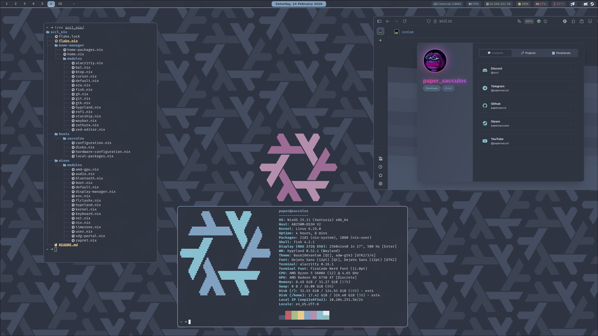

# sccl_nix

My NixOS config using flakes, home manager, disko.



## Config Structure

```diff
sccl_nix
 ├── flake.nix                # Main flake conf
 ├── flake.lock               # Dependencies
 ├── home-manager/            # Home Manager conf
 ├── hosts/
 │   └── sacculos/           # Host-specific conf
 └── nixos/
     └── modules/            # Reusable NixOS modules
```

---

## Installation

### Fresh NixOS Installation

#### 1. Boot into NixOS installer.

Idk u can use a minial iso or another distro.

#### 2. Clone repo:

```bash
git clone https://github.com/papersaccul/sccl_nix.git /mnt/etc/nixos
cd /mnt/etc/nixos
```

#### 3. Create host

Create ur own host in `./hosts/*`

it should look something like this:
```
hosts
└── sacculos
    ├── configuration.nix           # imports and other shi
    ├── disko.nix                   # disk conf
    ├── hardware-configuration.nix  # generated file
    └── local-packages.nix          # programs
```
u can copy my conf
```bash
cp -r /mnt/etc/nixos/hosts/sacculos /mnt/etc/nixos/hosts/<YOUR_HOSTNAME>
```

and edit `configuration.nix`:
```diff
...
- networking.hostName = "sacculos";
+ networking.hostName = "<YOUR_HOSTNAME>";
...
```
edit `disco.nix`, set up the partitions as u like:
```diff
{
  disko.devices = {
    disk.nvme0n1 = {              # Disc label (any)
        device = "/dev/nvme0n1";  # Path of the main disk, u can see it using the command `lsblk`
...
```
generate `hardware-configuration.nix` using command
```bash
nixos-generate-config --root /mnt --show-hardware-config --no-filesystems > hosts/<YOUR_HOSTNAME>/hardware-configuration.nix
```

#### 5. Install NixOS:

   ```bash
   # Install with my host
   nixos-install --flake .#sacculos
   
   # Install with ur own
   nixos-install --flake .#<YOUR_HOSTNAME>
   ```

####  6. **Set root password when prompted.**

#### 7. **Reboot:**
   ```bash
   umount -r /dev/nvme0n1
   # umount -r /dev/sda1
   
   reboot
   ```

### Migrating Existing NixOS System

#### 1. Backup your current configuration:

   ```bash
   sudo cp -r /etc/nixos /etc/nixos.backup
   ```

#### 2. Clone this repository:

   ```bash
   cd /tmp
   git clone https://github.com/papersaccul/sccl_nix
   cd sccl_nix
   ```

#### 3. Copy your hardware configuration:
Or create ur own following the 3rd point
   ```bash
   sudo cp /etc/nixos/hardware-configuration.nix hosts/sacculos/
   ```

#### 4. Review and merge your customizations

#### 5. Test the configuration:

   ```bash
   sudo nixos-rebuild test --flake .#sacculos
   # sudo nixos-rebuild test --flake .#<YOUR_HOSTNAME>
   ```

#### 6. If everything works, switch to the new configuration:

   ```bash
   sudo nixos-rebuild switch --flake .#sacculos
   # sudo nixos-rebuild switch --flake .#<YOUR_HOSTNAME>
   ```
---

## License

This configuration is provided as-is for personal use. Modify as needed for ur own systems.
