# sccl_nix
> [!NOTE]  
> /// NixOS config: `flakes` + `home-manager` + `disko`   
> /// Modular host-profile architecture -> scale across machines & users


## What's Inside¿
> [!NOTE] 
> /// Personal setup: `host::sacculos` + `profile::paper`  
> /// U can use as reference or starting point!! feel free 2 yoink anything~

**Window Managers:**
- **Niri** (main) - scrollable tiling
- **Hyprland** - dynamic tiling 
- Custom layouts: `ColemakCAWS | RulemakCAWS` - works 4 all hosts & profiles *(can disable it in WM settings if u want)*

**Shared packages** -> `profiles/shared/*` (all users):
- **CLI:** neofetch, ripgrep, fd, fzf, zoxide, bat, eza, btop
- **GUI:** thunar, vlc, mpv, evince, zathura
- **Utils:** grim, slurp, wl-clipboard, pavucontrol, appimage-run, gparted
- **Network:** firefox
- **Dev:** nixd, gh, zed-editor
- **Terminal:** alacritty w/ fish & starship
- **Launcher:** fuzzel (niri), rofi (hyprland)
- **Bar:** waybar
- **Themes:** Nordic, Papirus icons, Bibata cursor
- **Fonts:** JetBrains Mono, Noto, Font Awesome, Nerd Fonts

**System packages** -> `hosts/sacculos/*` (all users on this host):
- **Utils:** vim, wget, curl, git, htop, tree, nano, fastfetch, hyfetch (iykyk :D)
- **Archive:** p7zip, unzip, zip
- **Network:** networkmanagerapplet, webcord
- **Services:** zapret-discord-youtube (DPI bypass)

**My profile** -> `profiles/paper/*` (user-specific):
- **Network:** ayugram
- **Dev:** rustc, cargo, gcc, lmstudio, lazygit
- **Gaming:** steam, bottles, obs-studio, protonplus, steam-run
- **Creative:** kdenlive, krita, aseprite, blender, audacity
- **Audio:** easyeffects
- **Office:** libreoffice

## Table of Contents

- [Host-Profile System](#host-profile-system)
- [Config Structure](#config-structure)
- [Adding New Profiles](#adding-new-profiles)
- [Adding New Hosts](#adding-new-hosts)
- [Adding packages](#adding-packages)
- [Installation](#installation)

---

## Host-Profile System

This config uses a modular host-profile architecture that separates machine-specific settings from user configurations!

### How it works

```mermaid
flowchart TD
    F[❄️ flake.nix<br/>Auto-discovery]

    P1[👤 profiles/paper]
    P2[👤 profiles/guest]

    H1[🖥️  hosts/sacculos]
    H2[💻 hosts/laptop]

   NM[⚙️ nixos/modules<br/>System services]
   PS[📦 profiles/shared<br/>Base configs&packages]

    F --> H1
    F --> H2
    
    H1 --> P1
    H1 --> P2
    H2 --> P2
    
    P1 --> PS
    P2 --> PS
    
    H1 --> NM
    H2 --> NM
    
    classDef flakeStyle fill:#517599,stroke:#5e81ac,stroke-width:2px,color:#000000
    classDef hostStyle fill:#88c0d0,stroke:#5e81ac,stroke-width:2px,color:#000000
    classDef profileStyle fill:#a3be8c,stroke:#8fbcbb,stroke-width:2px,color:#000000
    classDef sharedStyle fill:#ebcb8b,stroke:#d08770,stroke-width:2px,color:#000000
    classDef moduleStyle fill:#b48ead,stroke:#bf616a,stroke-width:2px,color:#000000
    
    class F flakeStyle
    class H1,H2 hostStyle
    class P1,P2 profileStyle
    class PS sharedStyle
    class NM moduleStyle
```



### Why it's cool

**Separation:**
- `Hosts` -> hardware-specific: disk layout, drivers, system packages
- `Profiles` -> user-specific: packages, dotfiles, preferences
- `Shared` -> common base: WM configs, themes, base tools

**Ez scaling:**
- New machine? -> Drop dir in `hosts/` (auto-discovered by flake)
- New profile(user)? -> Copy profile, tweak packages
- Multiple profiles(users)? -> Import multiple profiles in host config

**DRY:**
- Shared configs -> `profiles/shared/`
- User profiles -> override only wha u need
- Zero copy-paste between machines


**Example:**
```
hosts/sacculos (desktop)  ->  profiles/paper (main user)    ->  profiles/shared (base)
                          ->  profiles/guest (second user)  ->  profiles/shared (base)

hosts/laptop (portable)   ->  profiles/paper (same user)    ->  profiles/shared (base)
```

Same usr profile works on different machines, same shared base for all users!

---

## Config Structure

```tree
sccl_nix
 ├── flake.nix                          # Main flake conf (auto-discovers hosts)
 ├── flake.lock                         # Dependencies
 ├── profiles/
 │   ├── shared/                        # Shared conf for all users
 │   │   ├── packages.nix               # Base packages w/ categories
 │   │   └── modules/                   # Base program configs
 │   └── paper/                         # User-specific conf
 │       ├── user.nix                   # System user settings
 │       ├── home.nix                   # Home Manager conf
 │       ├── packages.nix               # Extra user packages
 │       └── modules/                   # Config overrides
 ├── hosts/
 │   └── sacculos/                      # Host-specific conf
 │       ├── configuration.nix          # Main host config
 │       ├── disko.nix                  # Disk partitioning
 │       ├── hardware-configuration.nix # Generated file
 │       └── local-packages.nix         # System-wide packages (for all profiles)
 └── nixos/
     └── modules/                       # Reusable NixOS modules
```

---

## Adding New Profiles

### 1. Create profile dir

```bash
mkdir -p profiles/<username>/modules
```

### 2. Create files

U can copy from existing profile and edit (literally the easiest way):
```bash
cp -r profiles/paper profiles/<username>
```

Or create manually (if ur feeling adventurous~):

**[`profiles/<username>/user.nix`](profiles/paper/user.nix)** - system user settings:
```nix
{ config, pkgs, ... }:

{
  users.users.<username> = {
    isNormalUser = true;
    description = "Your Name";
    extraGroups = [ "networkmanager" "wheel" "video" "audio" ];
    shell = pkgs.fish;
    initialPassword = "changeme";
  };
}
```

**[`profiles/<username>/home.nix`](profiles/paper/home.nix)** - home manager conf:
```nix
{ config, pkgs, inputs, ... }:

{
  imports = [
    ../shared/packages.nix    # Base packages
    ../shared/modules         # Base configs
    ./packages.nix            # Extra packages
    ./modules                 # Config overrides
  ];

  home = {
    username = "<username>";
    homeDirectory = "/home/<username>";
    stateVersion = "25.11";
  };

  stylix.targets = {
    waybar.enable = false;
    rofi.enable = false;
    hyprland.enable = false;
  };

  programs.home-manager.enable = true;
}
```

**[`profiles/<username>/packages.nix`](profiles/paper/packages.nix)** - extra pkgs:
```nix
{ config, pkgs, ... }:

{
  home.packages = with pkgs; [
    # Development Tools
    zed-editor

    # another stuff...
  ];
}
```

**[`profiles/<username>/modules/default.nix`](profiles/paper/modules/default.nix)** - config overrides:
```nix
{ config, pkgs, ... }:

{
  imports = [
    # Add overrides if needed
    # ./git.nix  # Override git config
  ];
}
```

### 3. Add profile to host

Edit [`hosts/<hostname>/configuration.nix`](hosts/sacculos/configuration.nix):
```nix
{
  imports = [
    ./hardware-configuration.nix
    ./local-packages.nix
    ./disko.nix
    ../../nixos/modules
-    ../../profiles/paper/user.nix
+    ../../profiles/<username>/user.nix
  ];
-    networking.hostName = "sacculos";
+    networking.hostName = "<username>";

  # Home-manager configuration
  home-manager = {
    useGlobalPkgs = true;
    useUserPackages = true;
-    users.paper = import ../../profiles/paper/home.nix;
+    users.<username> = import ../../profiles/<username>/home.nix;

    extraSpecialArgs = {
      inherit inputs;
      pkgs-unstable = inputs.nixpkgs-unstable.legacyPackages.${pkgs.system};
    };
  };

  # Stylix global theme (Nord)
  stylix = {
    enable = true;
    base16Scheme = "${pkgs.base16-schemes}/share/themes/nord.yaml";
    image = pkgs.fetchurl {
      url = "https://github.com/OulipianSummer/nixos-pattern-nord-wallpapers/blob/master/jpgs/nix-d-nord-purple.jpg?raw=true";
      sha256 = "sha256-cqL194wcTxCKmSFf+z0BfyZlLAlFs8pnzAManlQbkjQ=";
    };
  };

  system.stateVersion = "25.11";
}

```

### 4. Rebuild

```bash
sudo nixos-rebuild switch --flake .#<hostname>
```

### Overriding shared configs

If u wanna change smth from shared conf (like git email), create override:

**`profiles/<username>/modules/git.nix`:**
```nix
{ config, pkgs, ... }:

{
  programs.git = {
    userEmail = "your@email.com";  # Override
  };
}
```

Import it in `profiles/<username>/modules/default.nix`:
```nix
{
  imports = [
    ./git.nix
  ];
}
```

---

## Adding New Hosts

### 1. Create host dir

```bash
mkdir -p hosts/<hostname>
```

### 2. Copy from existing host

```bash
cp -r hosts/sacculos hosts/<hostname>
```

See [`hosts/sacculos/`](hosts/sacculos/) for reference.

### 3. Edit hostname

In [`hosts/<hostname>/configuration.nix`](hosts/sacculos/configuration.nix):
```diff
- networking.hostName = "sacculos";
+ networking.hostName = "<hostname>";
```

### 4. Edit disk conf

In [`hosts/<hostname>/disko.nix`](hosts/sacculos/disko.nix), change disk path:
```diff
{
  disko.devices = {
    disk.nvme0n1 = {
-       device = "/dev/nvme0n1";
+       device = "/dev/sda";  # ur disk, check w/ `lsblk`
```

### 5. Generate hardware conf

```bash
nixos-generate-config --root /mnt --show-hardware-config --no-filesystems > hosts/<hostname>/hardware-configuration.nix
```

### 6. Build & test

```bash
nixos-rebuild build --flake .#<hostname>
```

That's it!! Flake auto-discovers the new host

---

## Adding packages

**For all users (Home Manager):**
- Edit [`profiles/shared/packages.nix`](profiles/shared/packages.nix) (everyone gets it!!)

**For specific user (Home Manager):**
- Edit [`profiles/<username>/packages.nix`](profiles/paper/packages.nix) (just 4 u~)
- **Or with custom config** (if u need fancy settings)
  - Create [`profiles/shared/modules/<program>.nix`](profiles/shared/modules/)
  - Import in [`profiles/shared/modules/default.nix`](profiles/shared/modules/default.nix)

**System-wide (for all users under profile):**
- Edit [`hosts/<hostname>/local-packages.nix`](hosts/sacculos/local-packages.nix)
- Use for system utils that need to be available globally (like the important stuff!!)

---

## Installation

### Option 1: nixos-anywhere new config

```bash
# 1. Fork/clone repo & create basic host conf
git clone https://github.com/papersaccul/sccl_nix.git
cd sccl_nix

# 2. Create min host (just copy & edit hostname + disko)
cp -r hosts/sacculos hosts/<hostname>
# Edit hostname in configuration.nix
# Edit disk paths in disko.nix
# learn more in "Adding New Hosts" and "Adding New Profile" section in this guide

# 3. Install w/ auto hardware config generation
nix run github:nix-community/nixos-anywhere -- \
  --generate-hardware-config nixos-generate-config hosts/<hostname>/hardware-configuration.nix \
  --flake .#<hostname> \
  root@<target-ip>
```


### Option 2: nixos-anywhere prepared config

If u already have conf

```bash
# Using local flake
nix run github:nix-community/nixos-anywhere -- \
  --flake .#<hostname> \
  root@<target-ip>

# Using GitHub (if u fork & push updated repo)
nix run github:nix-community/nixos-anywhere -- \
  --flake github:yourusername/sccl_nix#<hostname> \
  root@<target-ip>
```

### Option 3: Manual

#### Fresh install (the classic way~):

```bash
# 1. Boot NixOS installer
# 2. Clone repo
git clone https://github.com/papersaccul/sccl_nix.git /mnt/etc/nixos
cd /mnt/etc/nixos

# 3. Setup host (see "Adding New Hosts" section)
cp -r hosts/sacculos hosts/<hostname>
# Edit hostname & disk paths

# 4. Generate hardware conf
nixos-generate-config --root /mnt --show-hardware-config --no-filesystems > hosts/<hostname>/hardware-configuration.nix

# 5. Install
nixos-install --flake .#<hostname>

# 6. Reboot
reboot
```

#### Migrate (switching 2 this config):

```bash
# 1. Backup
sudo cp -r /etc/nixos /etc/nixos.backup

# 2. Clone
git clone https://github.com/papersaccul/sccl_nix ~/sccl_nix
cd ~/sccl_nix

# 3. Setup host (see "Adding New Hosts" section)

# 4. Test
sudo nixos-rebuild test --flake .#<hostname>

# 5. Switch
sudo nixos-rebuild switch --flake .#<hostname>
```
# License

> [!IMPORTANT]
> This configuration is provided as-is for personal use!! Modify as needed for ur own systems~ Use at ur own risk (but it should work fine lol)> 
>
> feel free 2 fork, star, or yoink whatever u need!!