# sccl_nix

> /// NixOS config: `flakes` + `home-manager` + `disko`   
> /// Modular host-profile architecture → scale across machines & users


## What's Inside

> /// Personal setup: `host::sacculos` + `profile::paper`  
> /// U can use as reference or starting point

**Window Managers:**
- **Niri** (main) - scrollable tiling
- **Hyprland** - dynamic tiling
- Custom layouts: `ColemakCAWS | RulemakCAWS` - works for all hosts & profiles

**Shared packages** → `profiles/shared/*` (all users):
- **CLI:** neofetch, ripgrep, fd, fzf, zoxide, bat, eza, btop
- **GUI:** thunar, vlc, mpv, evince, zathura
- **Utils:** grim, slurp, wl-clipboard, pavucontrol, appimage-run, gparted
- **Network:** firefox
- **Dev:** nixd, gh, zed-editor
- **Terminal:** alacritty w/ fish & starship
- **Launcher:** fuzzel (niri), rofi (hyprland)
- **Bar:** waybar
- **Themes:** Nordic, Papirus icons, Rose Pine cursor
- **Fonts:** JetBrains Mono, Noto, Font Awesome, Nerd Fonts

**System packages** → `hosts/sacculos/*` (all users on this host):
- **Utils:** vim, wget, curl, git, htop, tree, nano, fastfetch
- **Archive:** p7zip, unzip, zip
- **Network:** networkmanagerapplet, webcord
- **Services:** zapret-discord-youtube (DPI bypass)

**My profile** → `profiles/paper/*` (user-specific):
- **Network:** ayugram
- **Dev:** rustc, cargo, gcc, lmstudio, lazygit
- **Gaming:** steam, bottles, obs-studio, protonplus, steam-run
- **Creative:** kdenlive, krita, aseprite, blender, audacity
- **Audio:** easyeffects
- **Office:** libreoffice

## Table of Contents

- [Host-Profile System](#host-profile-system)
- [Config Structure](#config-structure)
- [Adding New Profiles](#adding-new-profiles)
- [Adding New Hosts](#adding-new-hosts)
- [Common Tasks](#common-tasks)
- [Installation](#installation)

---

## Host-Profile System

This config uses a modular host-profile architecture that separates machine-specific settings from user configurations.

### How it works

```mermaid
flowchart TD
    F[❄️ flake.nix<br/>Auto-discovery]

    P1[👤 profiles/paper]
    P2[👤 profiles/guest]

    H1[🖥️  hosts/sacculos]
    H2[💻 hosts/laptop]

   NM[⚙️ nixos/modules<br/>System services]
   PS[📦 profiles/shared<br/>Base configs&packages]

    F --> H1
    F --> H2
    
    H1 --> P1
    H1 --> P2
    H2 --> P2
    
    P1 --> PS
    P2 --> PS
    
    H1 --> NM
    H2 --> NM
    
    classDef flakeStyle fill:#517599,stroke:#5e81ac,stroke-width:2px,color:#000000
    classDef hostStyle fill:#88c0d0,stroke:#5e81ac,stroke-width:2px,color:#000000
    classDef profileStyle fill:#a3be8c,stroke:#8fbcbb,stroke-width:2px,color:#000000
    classDef sharedStyle fill:#ebcb8b,stroke:#d08770,stroke-width:2px,color:#000000
    classDef moduleStyle fill:#b48ead,stroke:#bf616a,stroke-width:2px,color:#000000
    
    class F flakeStyle
    class H1,H2 hostStyle
    class P1,P2 profileStyle
    class PS sharedStyle
    class NM moduleStyle
```



### Why it's cool

**Separation:**
- `Hosts` → hardware-specific: disk layout, drivers, system packages
- `Profiles` → user-specific: packages, dotfiles, preferences
- `Shared` → common base: WM configs, themes, base tools

**Ez scaling:**
- New machine? → Drop dir in `hosts/` (auto-discovered by flake)
- New profile(user)? → Copy profile, tweak packages
- Multiple profiles(users)? → Import multiple profiles in host config

**DRY:**
- Shared configs → `profiles/shared/`
- User profiles → override only what u need
- Zero copy-paste between machines


**Example:**
```
hosts/sacculos (desktop)  →  profiles/paper (main user)    →  profiles/shared (base)
                          →  profiles/guest (second user)  →  profiles/shared (base)

hosts/laptop (portable)   →  profiles/paper (same user)    →  profiles/shared (base)
```

Same user profile works on different machines, same shared base for all users!

---

## Config Structure

```diff
sccl_nix
 ├── flake.nix                          # Main flake conf (auto-discovers hosts)
 ├── flake.lock                         # Dependencies
 ├── profiles/
 │   ├── shared/                        # Shared conf for all users
 │   │   ├── packages.nix               # Base packages w/ categories
 │   │   └── modules/                   # Base program configs
 │   └── paper/                         # User-specific conf
 │       ├── user.nix                   # System user settings
 │       ├── home.nix                   # Home Manager conf
 │       ├── packages.nix               # Extra user packages
 │       └── modules/                   # Config overrides
 ├── hosts/
 │   └── sacculos/                      # Host-specific conf
 │       ├── configuration.nix          # Main host config
 │       ├── disko.nix                  # Disk partitioning
 │       ├── hardware-configuration.nix # Generated file
 │       └── local-packages.nix         # System-wide packages (for all profiles)
 └── nixos/
     └── modules/                       # Reusable NixOS modules
```

---

## Adding New Profiles

### 1. Create profile dir

```bash
mkdir -p profiles/<username>/modules
```

### 2. Create files

U can copy from existing profile and edit:
```bash
cp -r profiles/paper profiles/<username>
```

Or create manually:

**[`profiles/<username>/user.nix`](profiles/paper/user.nix)** - system user settings:
```nix
{ config, pkgs, ... }:

{
  users.users.<username> = {
    isNormalUser = true;
    description = "Your Name";
    extraGroups = [ "networkmanager" "wheel" "video" "audio" ];
    shell = pkgs.fish;
    initialPassword = "changeme";
  };
}
```

**[`profiles/<username>/home.nix`](profiles/paper/home.nix)** - home manager conf:
```nix
{ config, pkgs, inputs, ... }:

{
  imports = [
    ../shared/packages.nix    # Base packages
    ../shared/modules         # Base configs
    ./packages.nix            # Ur extra packages
    ./modules                 # Ur config overrides
  ];

  home = {
    username = "<username>";
    homeDirectory = "/home/<username>";
    stateVersion = "25.11";
  };

  stylix.targets = {
    waybar.enable = false;
    rofi.enable = false;
    hyprland.enable = false;
  };

  programs.home-manager.enable = true;
}
```

**[`profiles/<username>/packages.nix`](profiles/paper/packages.nix)** - ur extra packages:
```nix
{ config, pkgs, ... }:

{
  home.packages = with pkgs; [
    # Development Tools
    vscode

    # Extra Apps
    # add ur stuff here
  ];
}
```

**[`profiles/<username>/modules/default.nix`](profiles/paper/modules/default.nix)** - config overrides:
```nix
{ config, pkgs, ... }:

{
  imports = [
    # Add overrides here if needed
    # ./git.nix  # Override git config
  ];
}
```

### 3. Add profile to host

Edit [`hosts/<hostname>/configuration.nix`](hosts/sacculos/configuration.nix):
```nix
{
  imports = [
    # ... other imports
    ../../profiles/<username>/user.nix
  ];

  home-manager.users.<username> = import ../../profiles/<username>/home.nix;
}
```

### 4. Rebuild

```bash
sudo nixos-rebuild switch --flake .#<hostname>
```

### Overriding shared configs

If u wanna change smth from shared conf (like git email), create override:

**`profiles/<username>/modules/git.nix`:**
```nix
{ config, pkgs, ... }:

{
  programs.git = {
    userEmail = "your@email.com";  # Override
  };
}
```

Import it in `profiles/<username>/modules/default.nix`:
```nix
{
  imports = [
    ./git.nix
  ];
}
```

---

## Adding New Hosts

### 1. Create host dir

```bash
mkdir -p hosts/<hostname>
```

### 2. Copy from existing host

```bash
cp -r hosts/sacculos hosts/<hostname>
```

See [`hosts/sacculos/`](hosts/sacculos/) for reference.

### 3. Edit hostname

In [`hosts/<hostname>/configuration.nix`](hosts/sacculos/configuration.nix):
```diff
- networking.hostName = "sacculos";
+ networking.hostName = "<hostname>";
```

### 4. Edit disk conf

In [`hosts/<hostname>/disko.nix`](hosts/sacculos/disko.nix), change disk path:
```diff
{
  disko.devices = {
    disk.nvme0n1 = {
-       device = "/dev/nvme0n1";
+       device = "/dev/sda";  # ur disk, check w/ `lsblk`
```

### 5. Generate hardware conf

```bash
nixos-generate-config --root /mnt --show-hardware-config --no-filesystems > hosts/<hostname>/hardware-configuration.nix
```

### 6. Build & test

```bash
nixos-rebuild build --flake .#<hostname>
```

That's it! Flake auto-discovers the new host.

---

## Common Tasks

### Adding packages

**For all users (Home Manager):**
- Edit [`profiles/shared/packages.nix`](profiles/shared/packages.nix)
- Add package under category comment

**For specific user (Home Manager):**
- Edit [`profiles/<username>/packages.nix`](profiles/paper/packages.nix)
- **Or with custom config**
  - Create [`profiles/shared/modules/<program>.nix`](profiles/shared/modules/)
  - Import in [`profiles/shared/modules/default.nix`](profiles/shared/modules/default.nix)

**System-wide (for all users under profile):**
- Edit [`hosts/<hostname>/local-packages.nix`](hosts/sacculos/local-packages.nix)
- Use for system utilities that need to be available globally

### Updating system

```bash
# Update deps
nix flake update

# Rebuild
sudo nixos-rebuild switch --flake .#<hostname>
```

### Testing changes

```bash
# Check 
nix flake check

# Build w/o switching
nixos-rebuild build --flake .#<hostname>

# Test in VM
nixos-rebuild build-vm --flake .#<hostname>
./result/bin/run-<hostname>-vm

# Dry run
nixos-rebuild dry-run --flake .#<hostname>
```

### Rollback

```bash
# List gens
sudo nix-env --list-generations --profile /nix/var/nix/profiles/system

# Rollback to prev
sudo nixos-rebuild switch --rollback

# Switch to specific gen
sudo nix-env --switch-generation <number> --profile /nix/var/nix/profiles/system
sudo /nix/var/nix/profiles/system/bin/switch-to-configuration switch
```

### Cleanup

```bash
# Remove old gens
sudo nix-collect-garbage --delete-older-than 7d

# Optimize store
nix-store --optimize
```

---

## Installation

### Fresh NixOS Installation

#### 1. Boot into NixOS installer

Idk u can use a minimal iso or another distro.

#### 2. Clone repo

```bash
git clone https://github.com/papersaccul/sccl_nix.git /mnt/etc/nixos
cd /mnt/etc/nixos
```

#### 3. Setup ur host & profile

Follow [Adding New Hosts](#adding-new-hosts) section to create ur host config.

If u wanna add ur own profile instead of using mine, follow [Adding New Profiles](#adding-new-profiles) section.

Quick version:
```bash
# Copy existing host
cp -r hosts/sacculos hosts/<YOUR_HOSTNAME>

# Edit hostname in configuration.nix
# Edit disk paths in disko.nix (check w/ lsblk)

# Generate hardware conf
nixos-generate-config --root /mnt --show-hardware-config --no-filesystems > hosts/<YOUR_HOSTNAME>/hardware-configuration.nix
```

#### 4. Install NixOS

```bash
nixos-install --flake .#<YOUR_HOSTNAME>
```

#### 5. Set root password when prompted

#### 6. Reboot

```bash
umount -r /dev/nvme0n1  # or ur disk
reboot
```

### Migrating Existing NixOS System

#### 1. Backup ur current conf

```bash
sudo cp -r /etc/nixos /etc/nixos.backup
```

#### 2. Clone repo

```bash
cd /tmp
git clone https://github.com/papersaccul/sccl_nix
cd sccl_nix
```

#### 3. Setup ur host

Follow [Adding New Hosts](#adding-new-hosts) to create ur host config, or just copy ur hardware conf:
```bash
sudo cp /etc/nixos/hardware-configuration.nix hosts/sacculos/
```

#### 4. Review and merge ur customizations

#### 5. Test the conf

```bash
sudo nixos-rebuild test --flake .#<YOUR_HOSTNAME>
```

#### 6. If everything works, switch

```bash
sudo nixos-rebuild switch --flake .#<YOUR_HOSTNAME>
```

---

## License

This configuration is provided as-is for personal use. Modify as needed for ur own systems.
